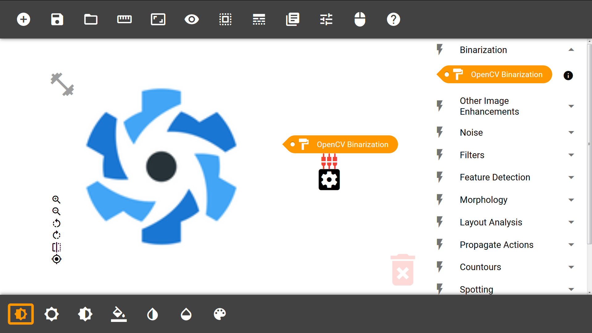
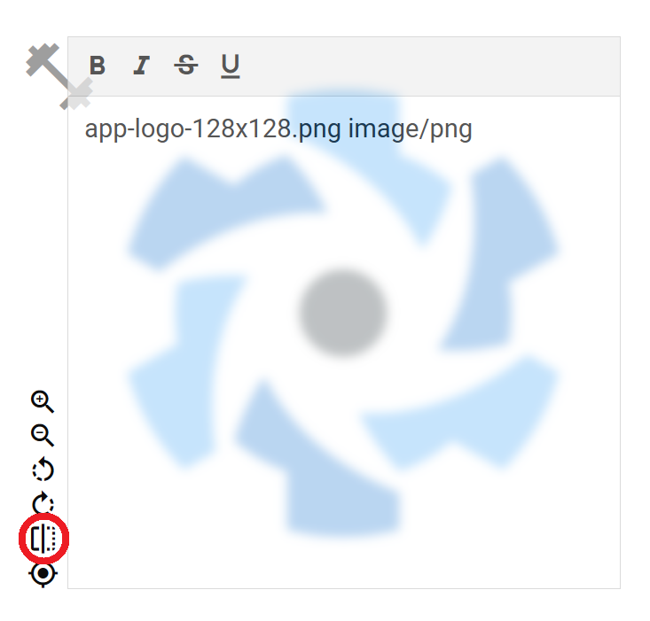
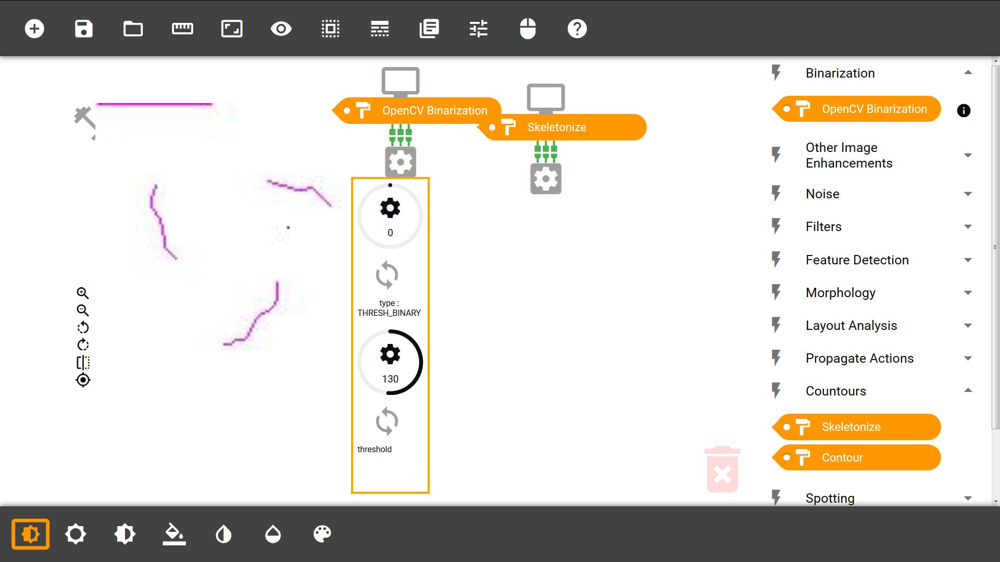
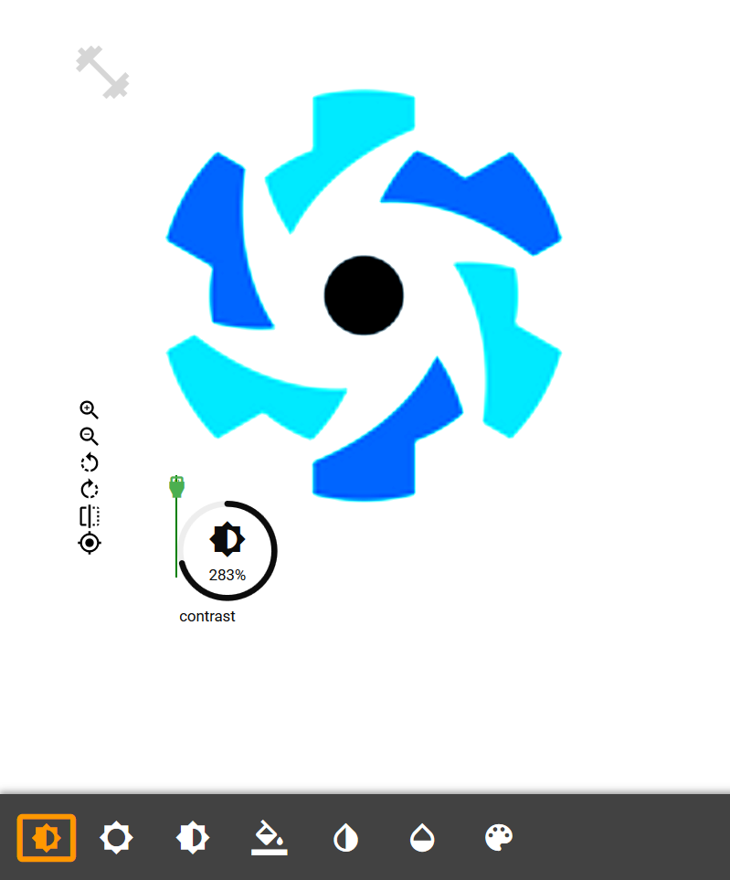
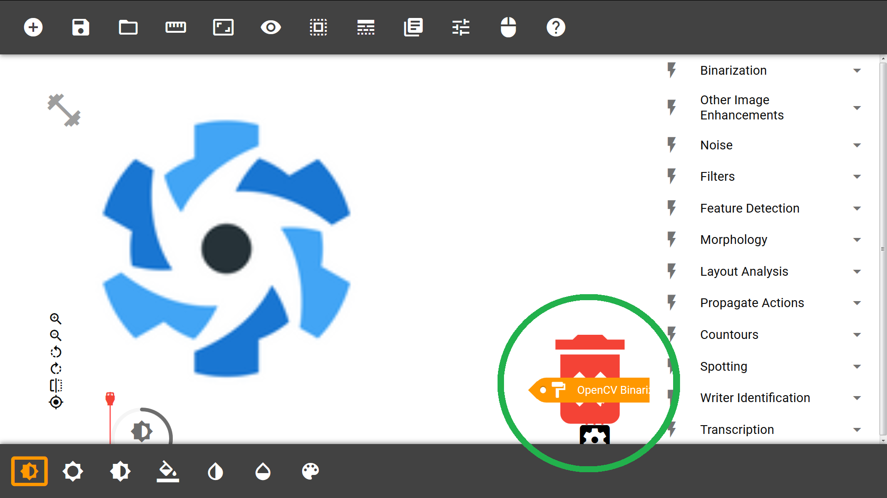
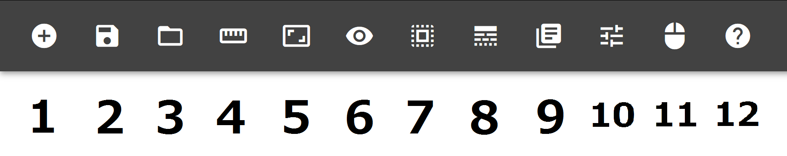
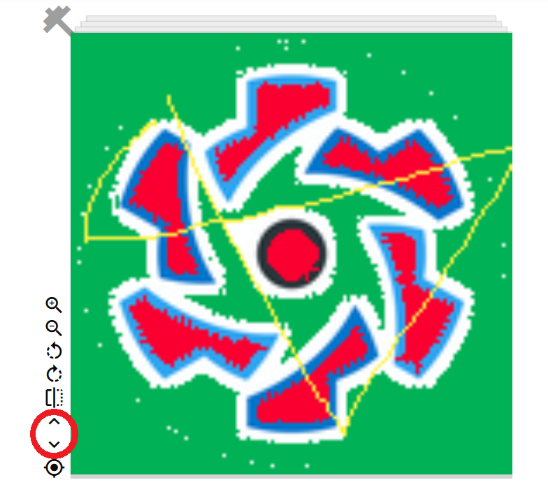
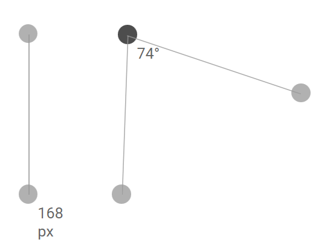
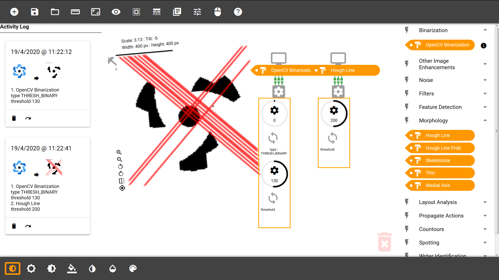

# AMAP Docs
AMAP - Advanced Manuscript Analysis Portal - is a software tool to aid the study of manuscripts. This documentation should be helpful in guiding you through the onboarding process, app navigation, and functinality.


```
Table of contents
0. Introduction
1. Getting started
2. Main Menu
3. Functionality (Action Chips)
4. Image View Settings (Plugs)
5. Image Menu
6. Advanced Topics
```


## 0. Introduction
AMAP is a platform-independent tool that includes a toolbox of document image analysis (DIA) functions. By providing a graphical user interface (GUI), it aims to make elements of traditional programming available to everyone without having to learn an actual programming language. Instead, AMAP uses ***Visual Programming*** to allow its users to generate and combine blocks to build their own image processing solutions. 

AMAP is a joint effort by the [Image Processing Department of the University of Hamburg](https://www.inf.uni-hamburg.de/en/inst/ab/bv.html) and is partly funded by the DFG (German research association) and SFB (Department of special studies). It is an open-source project.


## 1. Getting started
AMAP Version 2.0 is currently available under https://bv.informatik.uni-hamburg.de/amap and can be used online provided that you have a stable internet connection. This chapter will help you create your first workspace.


#### Fig. 1: An overview of AMAP

### 1.1 Loading an image
Our first goal is to load some data into the ***central workspace*** of AMAP where you will perform your DIA tasks. 

To load your image, click the "+" icon on the ***main menu*** located at the top. Browse and select an image from your computer to upload it. 

> Your image should be in a **JPG format** for all functions to work properly. To check what image format your image is, upload the image and click on the **flip over icon (5)**  on the **image menu** (detailed in **Chapter 5**) to toggle the notepad. Check to confirm whether the file name ends in .jpg, jpeg, .JPG, or JPEG.


#### Fig. 2: Flipping an image


### 1.2 Action chips
With your image in the workspace, we are all set up to perform some DIA. The ***functions menu*** on the right contains the respective functions for image processing, whereas the "image settings menu" at the bottom allows for temporal image view settings (see **1.4**).

Functions in AMAP are provided as so-called ***action chips*** which you can generate by double-clicking on an item in one of the dropdowns of the functions menu.

A corresponding action chip will be generated that you can attach to your image to perform its corresponding function. Many blocks allow for adjustable parameters settings which you can toggle by clicking the gear icon. For instance, the Binarization block at the very top of the functions menu lets you adjust a threshold with a circular slider.

Your input image will update to preview what your image looks like after some function has been performed. You can also detach a chip by double clicking on it to revert the image to its original state.


#### Fig. 3: We attach a "Binarization" chip to the input, and chain a "Skeletonize" chip to the result of "Binarization".

### 1.3 Chaining action chips
You can also chain compatible action chips which will connect automatically. Incompatible chips will repel each other. While the image preview now shows the processing result after going through all chips, you can also show intermediate previews (**Chapter 6.1.3**).

Detaching a block here will "split" your chain left of the block which you have clicked.


### 1.4 Plugs
Plugs apply filters that change the appearance of the image / chip that it is attached to ***temporally*** and will not result in any changes reflected in the final result, unlike action chips.


#### Fig. 4: We increase the contrast of the input image using a "Contrast" plug.

### 1.5 Deleting blocks
To delete a block, activate the trash can at the bottom right by clicking on it. Now drag-&-drop the block you would like to delete.

> Don't forget to **deactivate** the trash can after you are done deleting to avoid accidentally dragging and deleting blocks.


#### Fig. 5: Pulling an element toward the active (strong red) trash can.

### 1.6 Saving your data
You can either export your image processing results or save your workspace to continue your task later. 

To export your results, right-click on the image preview and select ***Save Image As...*** from the menu.

To save your workspace, press the ***2nd icon*** on the main menu. To load your workspace afterwards, press the ***3rd icon*** of the main menu and select your workspace.

> AMAP saves workspaces as **.JSON** files.


### 1.7 How to proceed
You have now been onboarded to the most basic functionality of AMAP. Please refer to **Chapters 2-5** for detailed explanations and documentation. **Chapter 6** elaborates on Advanced topics such how to work with image stacks (batch operation) and using tools to create an efficient workflow.


## 2. Main Menu
This chapter explains the Main Menu, helping you understand and navigate through the app. 


#### Fig. 6: The Main Menu
```
##### (1): Add Image
##### (2): Save Workspace
##### (3): Load Workspace
##### (4): Ruler
##### (5): Protractor
##### (6): Hide all objects
##### (7): Selection Rectangle
##### (8): Toggle Lines
##### (9): Logs
##### (10): Show scale and tilt
##### (11): Hide image icons
##### (12): Help
```

### 2.1 File operations
The basic file operations are basically what we have already seen in **Chapter 1**. You can ***add an image (1)***, ***save your workspace (2)***, and ***load a workspace (3)***.

### 2.1.1 Image stack
You can also load multiple images from your computer. This will load a stack of images that you can slide through using the ***up (6)*** and ***down (7) arrows*** on the image menu. DIA will be performed on the image that is shown on the stack.


#### Fig. 7: Image stack arrows for navigation

### 2.2 Ruler, Protractor
You can use geographic tools such as a ***ruler (4)*** and a ***protractor (5)*** that will be loaded into the workspace.

The ***ruler*** has two draggable dots connected by a straight line. The line's length is displayed in pixels and changes according to how you move the dots.

The ***protractor*** consists of three dots. The middle dot, which is connected to the other two dots by sa traight line each, displays the angle in degrees the two lines shape at this dot. All dots can be dragged.


#### Fig. 7: Ruler and Protractor

### 2.3 Selection rectangle
This tool lets you select a rectangular subregion or region of interest (ROI) within some image. You can apply this tool at any "stage" of your image processing where you have an image preview. All subsequent chips will be apply their functions on the ROI you have selected.


### 2.4 Toggable objects
You can toggle the visibility of all objects from the functions and image view settings menus with ***hide all objects (6)***, or toggle the visibilility of some elements as described in the following:

***Toggle lines (8)*** lets you toggle the lines.

***Hide image icons (11)*** toggles the icons on the ***image menu***.


## 2.5 Information display
There are also some information diplay menus.

The ***logs (9)*** will toggle a history of action you have done on the left side. You can see all the details and previews regarding what function with what parameters you have used, and when you did it. You may redo actions or delete them from the activity log.

***Show scale and tilt (10)*** displays the scale of an image relative to its original size and its tilt (rotation) in degrees. It also shows the scaled image dimensions in pixels.


#### Fig. 8: Information display of **activity log** (left) and **scale and tilt** (above the image).

## 3 Functionality (Action chips)
Here we will inspect the functionality and parameters of the action chips (right menu) in detail. Some more general image settings provided as plugs (bottom menu) will be explained in Chapter 4.


### 3.1 Binarization
### 3.1.1 OpenCV Binarization
**Type:** Image Processing

**Input:** Image

**Output:** Image

**Parameter 1:** Type { 0: THRESH_BINARY, 1: THRESH_BINARY_INV, 2: THRESH_TRUNC, 3: THRESH_TOZERO, 4: THRESH_TOZERO_INV }

**Parameter 2:** Threshold (range 0 - 255)

**Functionality:** Image binarization maps all image pixel values of the input image to a binary value of 0 or 1. The threshold defines the lower bound at which a value of 1 should be assigned. Binarization takes the mean of all RGB colour channels.


### 3.2 Other Image Enhancements
### 3.2.1 Histogram Eq 

**Type:** Image Processing

**Input:** Image

**Output:** Image

**Functionality:** Improves contrast by equalization; spreading out the most frequent intensity values.


### 3.3 Noise
### 3.3.1 NonLocal Denoising (1)

**Type:** Image Processing

**Input:** Image

**Output: Image

**Parameter 1:** filter_strength (range 0 - 200)

**Parameter 2:** template (range 0 - 50)

**Parameter 3:** search (range 0 - 100)

**Functionality:** Removes noise.


### 3.3.2 NonLocal Denoising (2)

**Type:** Image Processing

**Input:** Image

**Output: Image

**Parameter 1:** filter_strength (range 0 - 50)

**Parameter 2:** filter_strength_color (range 0 - 50)

**Parameter 3:** template (range 0 - 50)

**Parameter 4:** search (range 0 - 100)

**Functionality:** Removes noise.


### 3.3.3 Add Random Noise

**Type:** Image Processing

**Input:** Image

**Output:** Image

**Parameter 1:** type { 0: gaussian, 1: localvar, 2: poisson, 3: salt, 4: pepper, 5: s&p, 6: speckle }

**Parameter gaussian 2:** mean (range 0 - 1)

**Parameter gaussian 3:** var (range 0 - 1)

**Parameter salt 2:** amount (range 0 - 1)

**Parameter pepper 2:** amount (range 0 - 1)

**Parameter s&p 2:** amount (range 0 - 1)

**Parameter s&p 3:** salt_vs_pepper (range 0 - 1)

**Parameter speckle 2:** mean (range 0 - 1)

**Parameter speckle 3:** var (range 0 - 1)

**Functionality:** Adds random noise according to the chosen type and parameters.


### 3.4 Filters
### 3.4.1 Blur
**Type:** Image Processing

**Input:** Image

**Output:** Image

**Parameter 1:** kernelX (range 0 - 30)

**Parameter 2:** kernelY (range 0 - 30)

**Functionality:** Blurs the image.


### 3.4.2 Gaussian Blur
**Type:** Image Processing

**Input:** Image

**Output:** Image

**Parameter 1:** kernelX (range 0 - 30)

**Parameter 2:** kernelY (range 0 - 30)

**Functionality:** Blurs the image using a Gaussian.

### 3.4.3 Median Blur
**Type:** Image Processing

**Input:** Image

**Output:** Image

**Parameter 1:** kernel (range 0 - 30)

**Functionality:** Blurs the image using a median.


### 3.4.4 Bilateral Filter
**Type:** Image Processing

**Input:** Image

**Output:** Image

**Parameter 1:** kernel (range 0 - 50)

**Parameter 2:** sigma (range 0 - 200)

**Functionality:** Blurs the image using a bilateral filter.

### 3.5 Feature Detection
### 3.5.1 Canny
**Type:** Feature Detection

**Input:** Image

**Output:** Image with features

**Parameter 1:** threshold1 (range 0 - 1000)

**Parameter 2:** threshold2 (range 0 - 1000)

**Parameter 3:** aperture_size (range 0 - 20)

**Functionality:** Detects features.


### 3.5.2 Good Features to Trac
**Type:** Feature Detection

**Input:** Image

**Output:** Image with features

**Parameter 1:** kernel (range 0 - 50)

**Parameter 2:** sigma (range 0 - 200)

**Functionality:** Detects features.


### 3.5.3 ORB keypoints
**Type:** Feature Detection

**Input:** Image

**Output:** Image with features

**Functionality:** Detects keypoints.


### 3.6 Morphology
### 3.6.1 Hough Line
**Type:** Morphology

**Input:** Image

**Output:** Image with stuctural lines

**Parameter 1:** threshold (range 0 - 400)

**Functionality**: Adds hough lines to the image.


### 3.6.2 Hough Line Prob
**Type:** Morphology

**Input:** Image

**Output:** Image with stuctural lines

**Parameter 1:** threshold (range 0 - 400)

**Parameter 2:** min_length (range 0 - 1000)

**Parameter 3:** max_gap (range 0 - 100)

**Functionality**: Adds hough lines to the image.


### 3.6.3 Skeletonize
**Type:** Morphology

**Input:** Image

**Output:** Image with stuctural lines

**Functionality**: Adds a skeleton structure to the image according to its visually coherent components.


### 3.6.4 Thin (WIP)
**Type:** Morphology

**Input:** Image

**Output:** Image with stuctural lines

**Functionality**: .


### 3.6.5 Medial Axis (WIP)
**Type:** Morphology

**Input:** Image

**Output:** Image with stuctural lines

**Functionality**: .


### 3.7 Layout Analysis
### 3.7.1 Tesseract Lines
**Type:** Layout Analysis

**Input:** Image

**Output:** Segmented Image (terminal)

**Functionality:** Adds bounding boxes around visual components.


### 3.7.2 Tesseract Characters
**Type:** Layout Analysis

**Input:** Image

**Output:** Segmented Image (terminal)

**Functionality:** Adds bounding boxes around small visual components.


### 3.7.3 Histogram Lines
**Type:** Layout Analysis

**Input:** Image

**Output:** Segmented Image (terminal)

**Functionality:** Adds lines.


### 3.7.4 Kraken Lines
**Type:** Layout Analysis

**Input:** Image

**Output:** Segmented Image (terminal)

**Functionality:** Adds lines.


### 3.7.5 TopBase Lines
**Type:** Morphology

**Input:** Image

**Output:** Image

**Parameter 1:** scale (range 0 - 400)

**Parameter 2:** theta (range 0 - 2)

**Functionality:** 


### 3.7.6 MidInter Lines
**Type:** Morphology

**Input:** Image

**Output:** Image

**Parameter 1:** scale (range 0 - 400)

**Parameter 2:** theta (range 0 - 2)

**Functionality:** 


### 3.7.7 All Lines
**Type:** Morphology

**Input:** Image

**Output:** Image

**Parameter 1:** scale (range 0 - 400)

**Parameter 2:** theta (range 0 - 2)

**Functionality:** 


## 3.8 Propagate Actions
### 3.8.1 Copy
**Type:** Workflow

**Input:** Chain of blocks

**Output:** Chain of blocks

**Functionality:** Copies the chain of blocks that it is attached to.


### 3.8.2 Compile
**Type:** Workflow

**Input:** Chain of blocks

**Output:** Result of compilation

**Functionality:** Compiles the chain of blocks it is attached to.


### 3.9 Contours
### 3.9.1 Skeletonize
**Type:** Morphology

**Input:** Image

**Output:** Image with stuctural lines

**Functionality**: Adds a skeleton structure to the image according to its visually coherent components.


### 3.9.2 Contour
**Type:** Morphology

**Input:** Image

**Output:** Image with stuctural lines

**Functionality**: Traces the contour of the image according to its visible edges.


### 3.10 Spotting
### 3.10.1 Word Spot.
**Type:** Recognition

**Input:** Image

**Output:** Image with ROIs of guessed word entities

**Parameter 1:** method { 0: Corr, 1: SIFT }

**Parameter 2:** threshold (range 0 - 1)

**Functionality:** Highlights areas where the algorithm detects possible candidates for words.


### 3.11 Writer Identification
### 3.11.1 NBNN
**Type:** Classification

**Input:** Image

**Output:** Class

**Parameter 1:** method { 0: SIFT, 1: FAST }

**Parameter SIFT 2:** rotation (range 0 - 359)

**Parameter FAST 2:** keypoints (range 0 - 100)

**Functionality:** Tries to identify the scribe of a manuscript.


### 3.12 Transcription
### 3.12.1 Manual text
**Type:** Transcription

**Input:** Image

**Output:** Textfield (terminal)

**Functionality:** Lets you label the image with texts you write yourself.


### 3.12.2 OCR text
**Type:** Transcription

**Input:** Image

**Output:** Text (terminal)

**Functionality:** Lets you label the image with texts that an algorithm detects.


## 4 Image View Settings (Plugs)
Image View Settings can be found on the bottom menu and can be attached from below to input image. They are simple in that they only adjust one parameter each. They are temporal as they will not apply any actual changes to the exported result.

The image preview on the input image will reflect both changes from the plugs and the action chips, but the image preview on top of action chips (toggable by clicking the top monitor icon) will show only the actual result (without effects from the plugs).


### 4.1 Brightness
**Range:** 0% - 400%

**Default:** 100%

**Functionality:** This setting adjusts the brightness according to the value that you set in the slider. Higher values add "whiteness" to the image, while lower values result in "darkness".


### 4.2 Contrast
**Range:** 0% - 400%

**Default:** 100%

**Functionality:** This setting adjusts the contrast of your image. 

*Higher values* mean that the image pixel values will be pushed to the extremes in terms of saturation. That is, relatively brighter pixels will become brighter, while relatively dark pixels will be changed less. 

*Lower contrast values* will minimize the difference of the pixel values of darker and brighter pixels by reducing the saturation of the brighter pixels. 


### 4.3 Grayscale
**Range:** 0% - 100%

**Default:** 50%

**Functionality:** This setting maps the colour channels of an image to a grayscale channel. Its corresponding parameter sets the percentage of the grayscale channel vs. the RGB channels of the original image. Towards 0%, the input is retained completely, while at 100% the image will be completely grayscale.


### 4.4 Invert Colors
**Range:** 0% - 100%

**Default:** 50%

**Functionality:** This setting maps the colours of the input to their complementary colours with regard to the colour channel(s), where the percentage describes the prominence of the inverted values.

For example, a pixel with RGB (100, 200, 0) will be mapped to RGB (155, 55, 255) given parameter value 100%, as the range of each colour channel lies within (0, 255) (inclusive) and we would be looking for the complimentary value given the upper bound 255.

At 0%, the input is retained fully, while at 100%, all image pixel values are fully inverted.

A value of 50% means that original and inverted image pixel values level each other out, resulting in an intermediate gray value.


### 4.5 Opacity
**Range:** 0% - 100%

**Default:** 50%

**Functionality:** This setting adjusts the transparency of an image. At 100%, the image is fully visible, while at 0%, the image is completely invisible.


### 4.6 Hue-Rotate
**Range:** 0deg - 359deg

**Default:** 0deg

**Functionality:** Rotates the colour values based on the hue on a 360 degree scale. A parameter value of 180 degrees results in the complimentary (inverted) image.


## 5 Image menu
The image menu mostly contains simple geographical settings for the input image. It can be found on the bottom left of the input image preview, provided that they are set visible on the ***main menu (11)***.

**Zoom in (1)** increases the scale of the image by about 5% of its current scale.

**Zoom out (2)** decreases the scale of the image by about 5% of its current scale.

**Rotate left (3)** rotates the image by 5 degrees to the left.

**Rotate right (4)** rotates the image by 5 degrees to the right.

**Flip (5)** toggles the notepad (reverse of the input image), displaying the file name, input file type, and provides a simple text tool for you jot down some notes.

**Previous image (6)** (visible with image stacks only) lets you navigate up an image stack.

**Next image (7)** (visible with image stacks only) lets you navigate down an image stack.

**Toggle original image (8)** toggles the original image as if the action chips had not been applied.


## 6 Advanced Topics
This chapter deals with some more advanced topics and quirks of AMAP. It also elaborates on some points from the previous chapters.


### 6.1 Practical workflow
There is no right or wrong way of working with this application. We encourage you to experiment with as many different functions and parameters to find **your** preferred setup. However, we would like to point out some aspects for you to better understand what you can do with AMAP

### 6.1.1 Data flow
The data flow in AMAP is pretty straightforward. You get your input, apply some action chips, and get an output at the end of the chain of actions. You may ***copy*** your chain of actions and also repeatedly perform that same routine of actions (looping).

You can also branch off to different paths with sub-segments of your image, e.g., when you perform image segmentation. Each branch can then be processed separately.

While the results at the end of your chain(s) of actions can be seen as your input going through that chain, the image view settings and image settings may be best understood as some kind of glasses that you can put on to take a different view on yout input.


### 6.1.2 Stacking images
You can stack images, which allows you to process multiple images with the same routine. When you have multiple images, you can select the one to be previewed by clicking the ***up (6) and down (7) arrows*** of the ***image menu***. As soon as you change the preview, all action chipts and plugs will do their work to update the preview.


### 6.1.3 Image Previews
The default image preview always shows the image result after going through the action chips' processing and image preview settings. However, you can always consult intermediate results by clicking on the monitor on top of the action chips (if available). These intermediate previews show all processing from the input image up to that chip and do not include effects from the image view setting filters.


>You can also export intermediate results as shown on the previews by right-clicking the image and selecting **Save Image As ...** from the menu.


### 6.2 Shortcuts
There are a few less obvious shortcuts which you can make use of:

**Copy image** can be done by double-clicking your input image.

**Dumbell** is an icon on the top left of your input image. Its functionality is a mystery.
